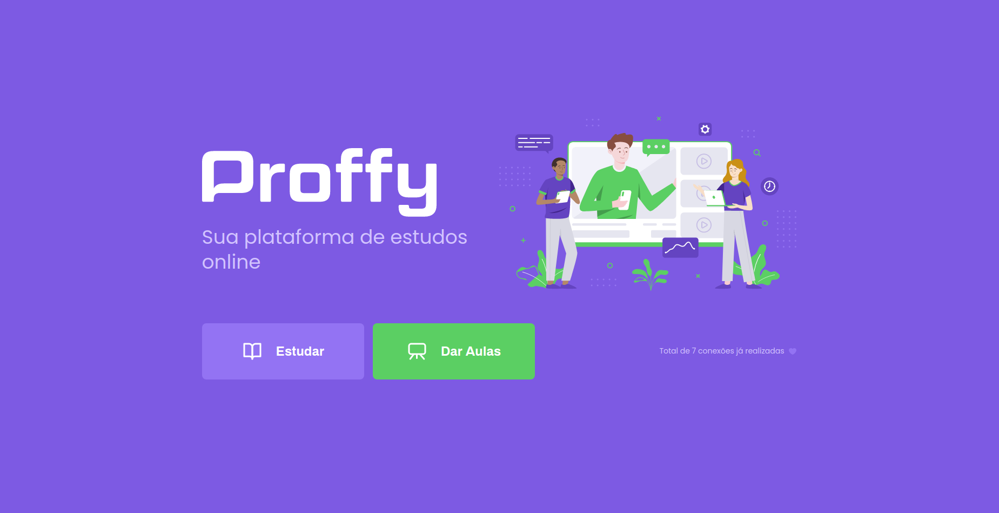
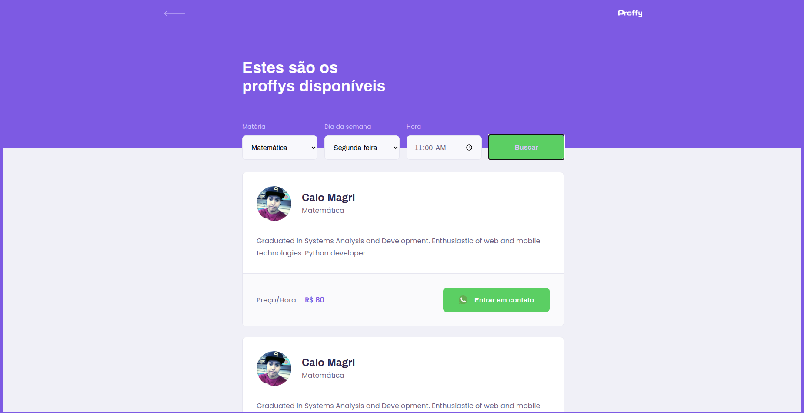
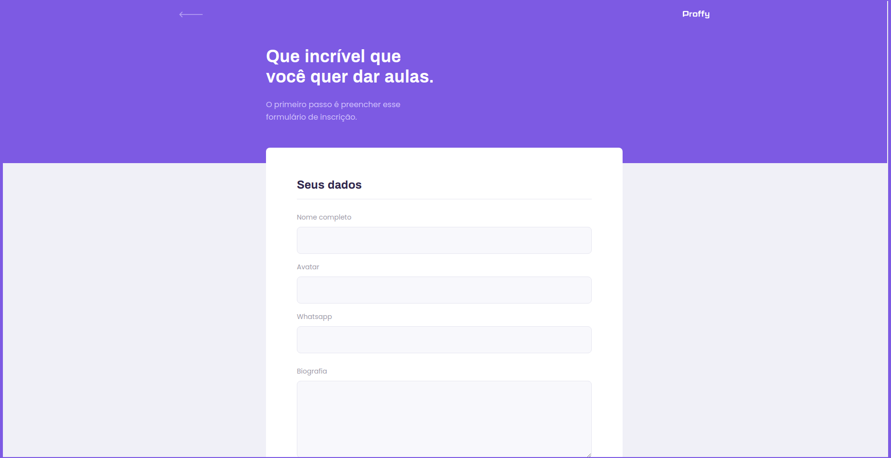
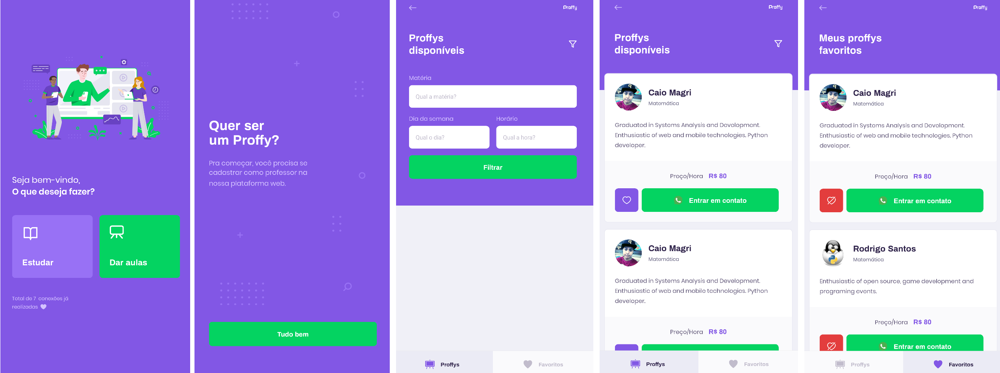

<p align="center">
   
</p>

<p align="center">	
   <a href="https://www.linkedin.com/in/caio-magri-318a42a1/">
      
   </a>
  

  <a aria-label="Completed" href="https://nextlevelweek.com/episodios/omnistack/edicao/2">
    </img>
  </a>
  <a href="https://github.com/kaiomagri/nlw2/commits/master">
    
  </a> 
  
  <a href="https://github.com/kaiomagri/nlw2/stargazers">
    
  </a>
</p>


## Application Proposal

> This project was made with the proposal to connect the teachers to students and was conceived by [RocketSeat](https://rocketseat.com.br/) at the Next Level Week event #2.


# :computer: Technologies

## Server
* [Typescript](https://www.typescriptlang.org/)      
* [NodeJS](https://nodejs.org/en/)
* [Express](https://expressjs.com/pt-br/)
* [Knex.js](http://knexjs.org/#changelog)

## Web

 * [ReactJs](https://pt-br.reactjs.org/)
 * [Typescript](https://www.typescriptlang.org/) 

## Mobile

* [Typescript](https://www.typescriptlang.org/)
* [React Native](https://reactnative.dev/)

* [Flutter](https://flutter.dev/)


### Front end Web with ReactJS
<div>
   
   
   
</div>

### Front end Mobile React Native
<div>
   
</div>

### Front end Mobile Flutter
<div>
   
</div>

# :settings: How to run
```bash
# Clone Repository
$ git clone https://github.com/kaiomagri/nlw2.git
```

### Run Server

```bash
# Go to server folder
$ cd nlw2/server

# Install Dependencies
$ yarn install

# Run Aplication
$ yarn start
```
Access the server API at http://localhost:3333/

### Web Project

```bash
# Go to web folder
$ cd nlw2/web

# Install Dependencies
$ yarn install

# Run application
$ yarn start
```
You can see here http://localhost:3000/

### Run Mobile React Native

** You need a emulator or mobile with app [expo](https://play.google.com/store/apps/details?id=host.exp.exponent)

```bash
# Go to mobile folder
$ cd nlw2/mobile_react_native

# Install Dependencies
$ yarn install

# Run application
$ yarn start
```

### Run Mobile Flutter

*** you need the flutter installed in your machine [Flutter](https://flutter.dev/docs/get-started/install)

```bash
# Go to mobile folder
$ cd nlw2/mobile_flutter

# Install Dependencies
$ flutter pub get

# you can run the app with the editor running engine
# Run application
$ flutter run
```

# License

Released in 2020 :closed_book: License
This project is under the [MIT license](./LICENSE).